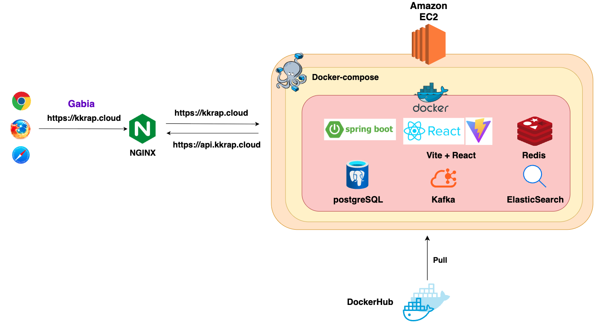
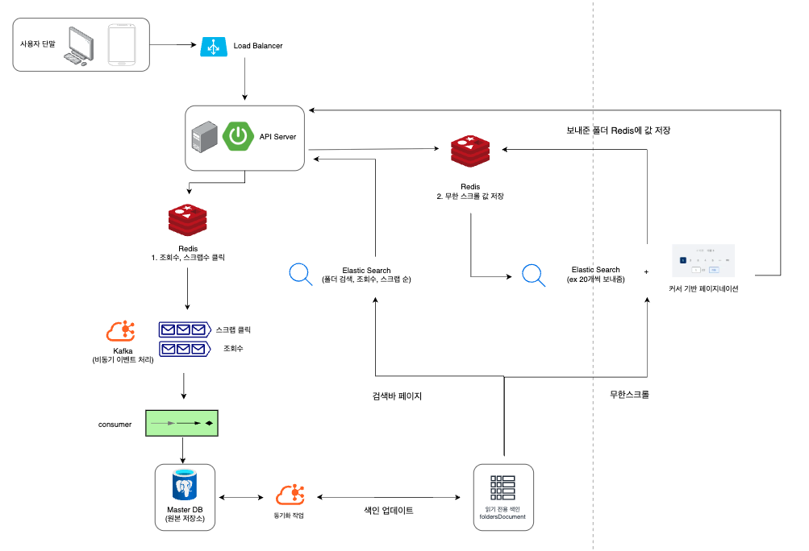

<h1> 🔥 Kkrap </h1>

 - 이 레포지토리는 Kkrap의 BackEnd입니다.

<h2> 🌈 프로젝트 소개 </h2>

 - kkrap은 사용자들이 정보 수집과 공유를 하기 위해 링크를 간편하게 저장할 수 있는 어플리케이션입니다.
 - 단순히 링크를 저장하는 것만이 아닌 사용자가 원하는 대로 폴더를 만들어 링크들을 분류할 수 있으며 폴더의 공유를 통해 다른 사용자와 채팅 기능도 사용할 수 있습니다.
 - 공유된 폴더에 링크들을 다른 사용자들이 한 번에 볼 수 있고 추가도 가능한 어플입니다.
 - 이 레포지토리는 Kkrap의 BackEnd이며 kkrap은 사용자들이 정보 수집과 공유를 하기 위해 링크를 간편하게 저장할 수 있는 어플리케이션입니다.
 - 단순히 링크를 저장하는 것만이 아닌 사용자가 원하는 대로 폴더를 만들어 링크들을 분류할 수 있으며 폴더의 공유를 통해 다른 사용자와 채팅 기능도 사용할 수 있습니다.
 - 공유된 폴더에 링크들을 다른 사용자들이 한 번에 볼 수 있고 추가도 가능한 어플입니다.

<h2> ⏱ 개발 기간 및 버전</h2>

- 2024.07.08 ~ ing

| 버전    | 기간         | 주요 내용             | 비고 |
|-------|------------|-------------------|----|
| 1.0.0 | 2025.08.25 | 프로젝트 초기 개발(모든 기능) | 완료 |
| 1.0,1 | 2025.08.25 | 비회원 기능 추가         | 완료 |
| 1.0.2 | 2025.08.26 | 에러 수정             | 완료 |
| 1.1.0 | 2025.08.28 | 베타 테스트 릴리즈        | 완료 |

<h2> 🚀 멤버 구성 </h2>

 - PM : 정재윤
 - Backend : 정재윤, 김강민
 - Frontend : 이호진, 김상우

<h2> 개발 환경 </h2>

 

     

   

<h2> 🚀 코딩 컨벤션 </h2>

- feat 새로운 기능 추가
- fix 버그 수정
- docs 문서 수정 (README.md, 주석 등)
- style	코드 스타일 변경 (포맷팅, 세미콜론 수정 등)
- refactor 코드 리팩토링 (기능 변경 없음)
- perf 성능 개선 
- test 테스트 코드 추가/수정 
- chore	빌드, 패키지 매니저 설정 변경 (의존성 업데이트 등), 자잘한 수정
- ci CI/CD 설정 변경 (GitHub Actions, Jenkins 등)
- build	빌드 시스템 변경 (Webpack, Rollup 등)
- revert	이전 커밋 되돌리기 
- temp	임시 변경 사항 (이후 삭제될 가능성 있음)

<h2> 전체 아키텍처 </h2>

  

  

<h2> 📌 주요 기능 문서 </h2>

[//]: # (- 🔗 [아키텍처 개요]&#40;./docs/architecture.md&#41;)

[//]: # (- 📁 [폴더 기능]&#40;./docs/feature-folder.md&#41;)
- 🌐 [링크 저장 및 조회 기능](./docs/feature-link.md)
- 📁 [elasticsearch 기능](./docs/feature-elasticsearch.md)
- 🔐 [JWT 로그인 기능](./docs/feature-login.md)
- 📖 [CI/CD](./docs/feature-login.md)

[//]: # (- 💬 [채팅 기능]&#40;./docs/feature-chat.md&#41;)

[//]: # (- 🔐 [인증 및 보안]&#40;./docs/feature-auth.md&#41;)

