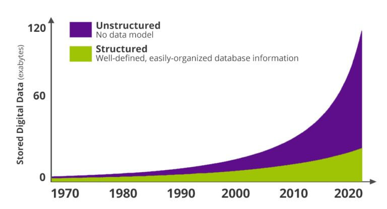
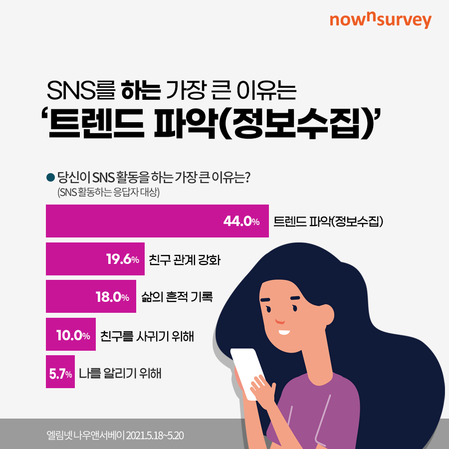
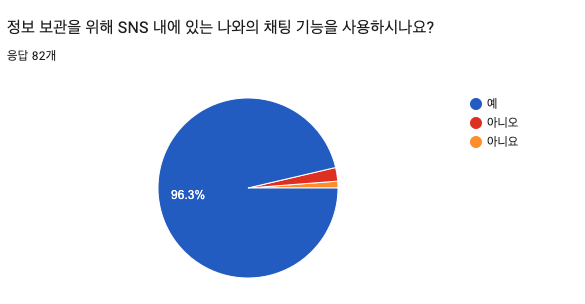
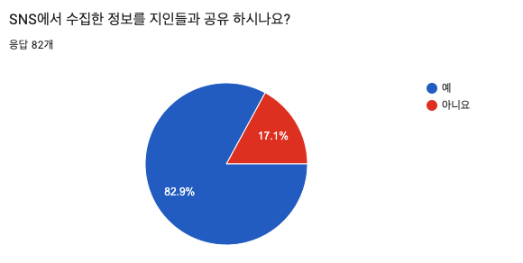
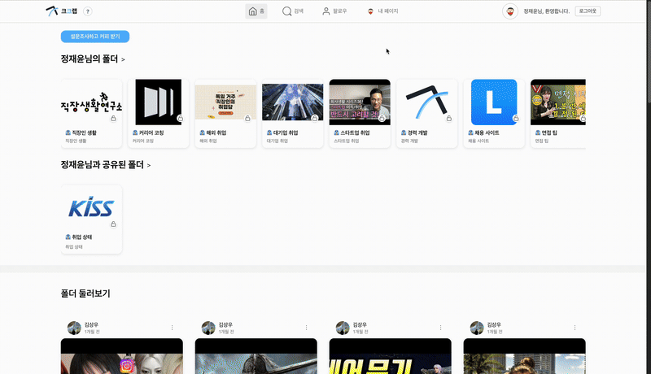
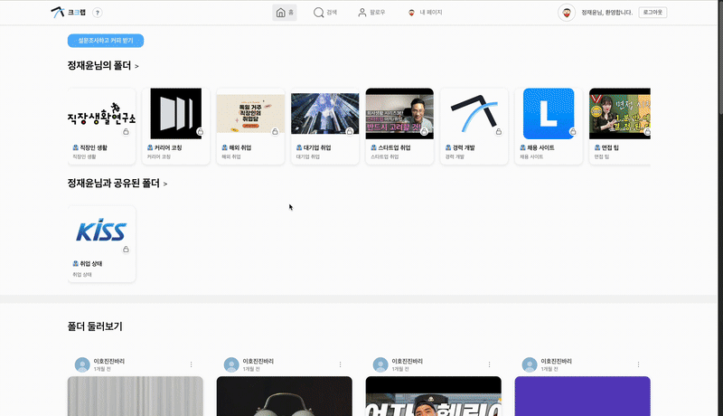
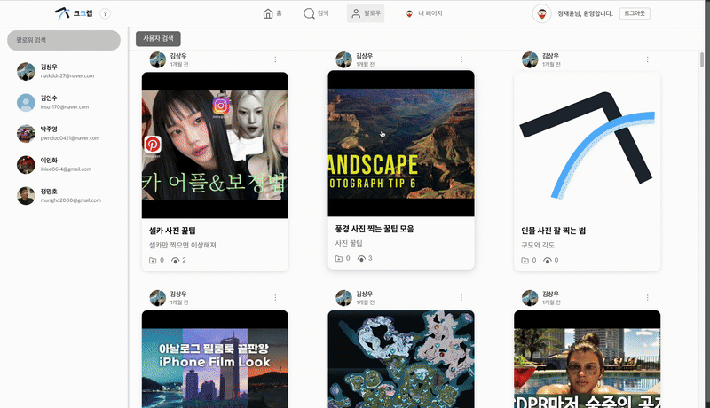
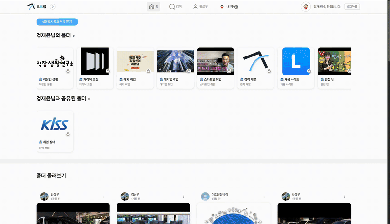
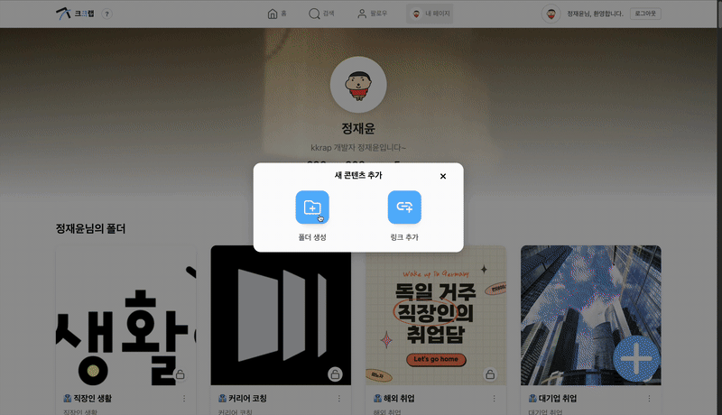
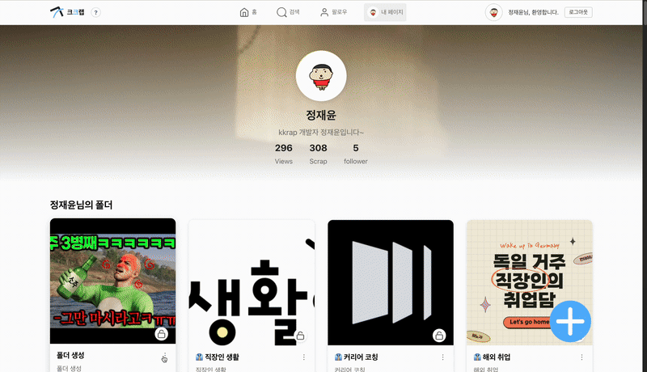

## 프로젝트 제목

kkrap - 링큐 큐레이션 & 공유 플랫폼
(”나만의 링크 정리함, 함께 공유하는 네트워크”)
- 이 레포지토리는 Kkrap의 BackEnd입니다.

 

## 프로젝트 간단 설명

소셜 미디어의 비정형 데이터가 폭발적으로 증가함에 따라 사용자는 다양한 플랫폼에서 수집한 정보를 효율적으로 보관하고 공유하는 데 어려움을 겪고 있다. kkrap은 여러 SNS와 웹에서 스크랩한 링크를 한 곳에 모아 정리하고 팔로우 기반 관계를 통해 지인들과 간편하게 공유할 수 있는 링크 큐레이션 플랫폼이다.

 

## 프로젝트 개요 (Overview)

- 문제 상황
    - SNS 확산으로 비정형 데이터(그림 1)가 급격히 증가
    - 국내 평균 6개의 SNS 계정을 사용하며, 주 사용 목적은 ‘트렌드 파악 및 정보 수집’(그림 2)
    - 수집된 정보를 개인 보관용 기능(나와의 채팅 등)에 저장하는 사례 96.3%(그림 3)
    - 공유 성향 또한 높아 82.9%가 지인과 정보를 교환(그림 4)
    - 하지만 현재는 여러 SNS를 오가며 링크를 관리해야 하고, 공유 시 플랫폼이 제각각이어서 불편
- 프로젝트 목적
    - 여러 소셜 미디어에서 수집한 링크를 하나의 플랫폼에 통합
    - 수집한 링크를 체계적으로 분류/보관하고 손쉽게 공유
    - 팔로우 관계를 통해 지인 간의 정보 소통을 강화
    - 결과적으로 정보 관리의 번거로움을 줄이고 효율적인 지식 네트워크를 형성

> 
> 

>  
> 

> 
그림 1. 비정형 데이터 추세 

> 

>  
> 

> 
> 
그림 2. SNS 활동 이유 

> 

>  
> 

> 
그림 3. 나와의 채팅 기능 사용 유무 

> 

>  
> 

> 
그림 4. 수집한 정보 공유 유무

 

## 팀/역할

| 이름 | 담당 역할 | 주요 업무 |
| --- | --- | --- |
| **정재윤** | Backend 개발 총괄 | - Spring Boot 기반 서버 개발 전반 담당  - API 설계 및 구현 (폴더, 링크, 통계 등 주요 도메인)  - JWT 인증 구조 설계 및 보안 적용  - CI/CD 파이프라인, Docker, AWS 인프라 구축  - Elasticsearch, Redis, Kafka 등 주요 기술 스택 연동 |
| **김강민** | Backend 기술 지원 및 테스트 | - 테스트 코드 작성 및 서버 로직 검증  - 예외 처리 및 API 응답 구조 개선  - 기술 문서화 및 기능별 테스트 자동화 |
| **이호진** | Frontend 개발 및 배포 담당 | - 메인 페이지 / 마이페이지 UI 및 기능 구현  - Capacitor를 활용한 Android·iOS 빌드 및 배포  - 앱 퍼포먼스 개선 및 PWA 연동 테스트 |
| **김상우** | Frontend 기능 개발 | - 검색 페이지 구현 (Elasticsearch 연동)  - OAuth 2.0 기반 소셜 로그인 기능 개발  - UX/UI 개선 및 사용자 인증 연동 테스트 |

## 개발 기간 및 버전

- 2025.03.04 ~ 진행중

| 버전    | 기간         | 주요 내용             | 비고 |
|-------|------------|-------------------|----|
| 1.0.0 | 2025.08.25 | 프로젝트 초기 개발(모든 기능) | 완료 |
| 1.0,1 | 2025.08.25 | 비회원 기능 추가         | 완료 |
| 1.0.2 | 2025.08.26 | 에러 수정             | 완료 |
| 1.1.0 | 2025.08.28 | 베타 테스트 릴리즈        | 완료 |

 

## 개발 환경

### 🔑 Backend

  
  
  
   

  
  
  
   

  
  
  
  
   

  
  
  
  
  
   

  
  
  
  
   

  
  
  

### 📖 Frontend

  
  
   

  
  
  
  
  

 

## 코딩 컨벤션 

- feat 새로운 기능 추가
- fix 버그 수정
- docs 문서 수정 (README.md, 주석 등)
- style	코드 스타일 변경 (포맷팅, 세미콜론 수정 등)
- refactor 코드 리팩토링 (기능 변경 없음)
- perf 성능 개선
- test 테스트 코드 추가/수정
- chore	빌드, 패키지 매니저 설정 변경 (의존성 업데이트 등), 자잘한 수정
- ci CI/CD 설정 변경 (GitHub Actions, Jenkins 등)
- build	빌드 시스템 변경 (Webpack, Rollup 등)
- revert	이전 커밋 되돌리기
- temp	임시 변경 사항 (이후 삭제될 가능성 있음)

 

## 시스템 아키텍처 / 구조도

  

  

### 주요 기능 - Web (로그인 부분 필요)
- 폴더 검색
- 엔터 검색과 텍스트 기반 검색
- 조회수 및 스크랩순

  

 

- 메인 페이지
- 나의 폴더 및 공유된 폴더 조회
- 무한 스크롤

  

 

- 팔로우
1. 친구 활동기록 보기, 팔로잉 추가 및 삭제

  

 

- 내 페이지
1. 나의 폴더 및 공유된 폴더 조회

  

 

2. 폴더 생성 및 링크 추가

  

 

3. 폴더 공유하기(권한 추가 및 삭제)

  

 

## 성과 및 기술적 개선(문제점 해결 및 실패한 점) 및 지표

### 성과

기능 성과

> Elasticsearch 기반 검색 고도화
> 
> 📁 [elasticsearch 검색 도화 문서](./docs/feature-elasticsearch.md) 
> 
> 기존 RDB 기반 LIKE 검색의 한계를 보완하기 위해 Elasticsearch를 도입했습니다.
> 다중 필드 검색과 연관도 기반 정렬을 구현하여 대량 데이터에서도 안정적인 검색 환경을 구축했습니다.

> Jenkins CI/CD 자동화 구축
> 
> 📖 [CI/CD 자동화 구축 문서](./docs/feature-login.md)
>
> Jenkins Pipeline과 Docker Compose를 활용해 빌드 → 테스트 → 배포 과정을 자동화했습니다.
> 이를 통해 배포 오류를 줄이고 코드 변경 시 신속하게 배포가 가능한 환경을 마련했습니다.

> JWT 기반 로그인 인증 구조 개선
> 
> 🔐 [JWT 로그인 기능](./docs/feature-login.md)
>
> Spring Security의 필터 체인을 이해하고, JWT 토큰 기반 인증 및 인가 로직을 직접 설계했습니다. 
> 세션리스 인증 구조를 통해 서버 부하를 줄이고 유지보수가 용이한 구조를 확보했습니다.

외부 성과 및 지원 이력
1. 부산 IT 모각코 사이드 프로젝트 지원 사업 선정
- 기간 : 2025년 9월 ~ 2025년 11월 (3개월)
- 주관/기관 : 부산정보산업진흥원, 부산IT모각코
- 설명 : 부산정보산업진흥원 주관 ‘부산 개발자 사이드 프로젝트 지원사업’에 선정되어 40만원 바우처와 멘토링 지원을 받아 프로젝트를 고도화했습니다.

 

### 기술적 개선(문제점 해결 및 실패한 점)
- 문제점 해결

> [블로그 참고: URL 메타데이터 추출 기능 개선 문서 - (EC2 대응)](https://wo-dbs.tistory.com/239)

> [블로그 참고: JWT 기반 인증 도입 개선 문서](https://wo-dbs.tistory.com/246)

- 실패한점

### 지표

