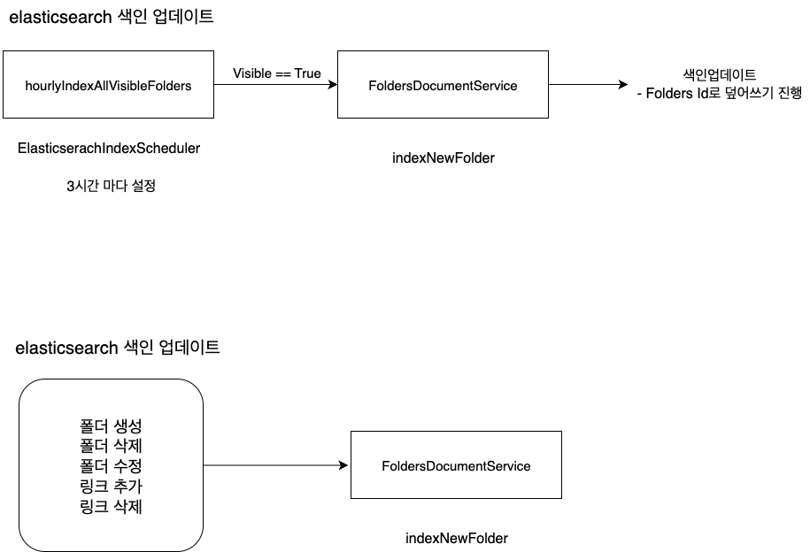
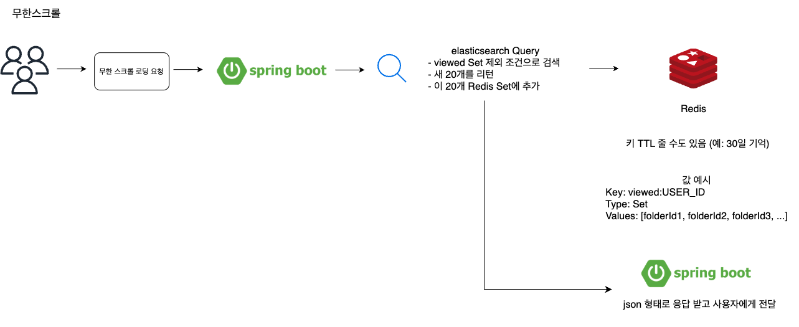
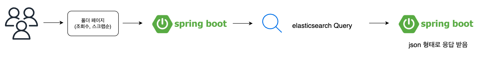
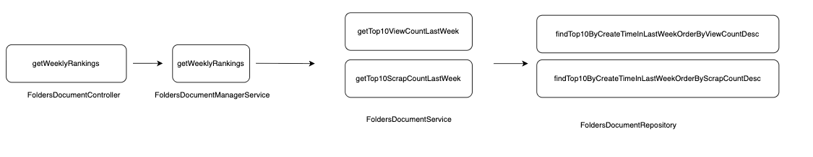
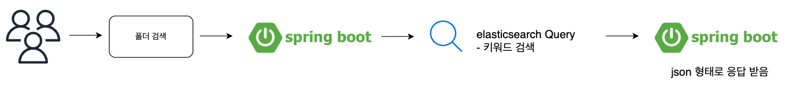
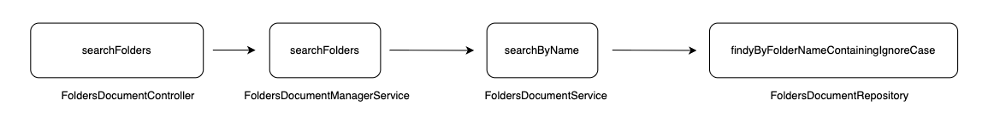

## 🔍 Elasticsearch 기능

---

Elasticsearch는 폴더의 검색, 정렬, 필터링 기능을 빠르고 정확하게 제공하기 위한 검색 엔진입니다.  
RDB 기반 LIKE 검색의 성능 한계를 극복하고, 실시간으로 최신 상태를 반영할 수 있도록 설계했습니다.

### ElasticSearch를 개발하기 위한 공부
[블로그 참고: 검색엔진이란?](https://wo-dbs.tistory.com/240)

[블로그 참고: ElasticSearch란?](https://wo-dbs.tistory.com/241)

### 기능 개요 및 목적, 배경
[블로그 참고: 폴더 검색 기능 설계 문서](https://wo-dbs.tistory.com/242)


## ⏱️ 색인 갱신 전략

---

- 스케줄링 시간은 3시간으로 임의로 잡아두었습니다
- 각 폴더, 링크 기능에서 CUD가 일어날 때 색인에도 업데이트가 되도록 했습니다.
<p align="center">
  
</p>

## 🎯 Elasticsearch 사용 기능 요약

---

### 1. 메인 페이지 무한 스크롤 폴더 조회
사용 목적: 로그인하지 않은 사용자도 다른 유저들의 폴더를 탐색할 수 있도록, 무한 스크롤 기반의 폴더 리스트 제공

Elasticsearch 활용 내용:
- visible=true인 폴더 중 최신순으로 정렬 
- 커서 기반 페이지네이션 (search_after) 사용 
- 대표 썸네일과 닉네임 포함 색인

장점:
- 성능 부담 없이 대량 데이터 페이징 가능 
- DB가 아닌 ES만으로 정렬 + 조회 처리


```json
{
  "query": {
    "match_all": {}
  },
  "sort": [
    { "createTime": "desc" }
  ],
  "size": 20,
  "search_after": ["2024-07-29T10:00:00.000Z"]
}
```

<p align="center">
  
</p>


### 2. 인기 폴더 정렬 (좋아요/스크랩수 기준)
사용 목적: 사용자에게 인기 있는 폴더를 일주일/한 달 기준으로 보여주기 위한 정렬

Elasticsearch 활용 내용:
- scrapCount, viewCount를 색인에 포함
- range 필터와 sort 조합으로 구현
예: 최근 일주일간 스크랩 수가 많은 폴더 상위 10개

장점:
복잡한 정렬 조건도 빠르게 처리
RDB에서 집계하지 않아도 됨 (성능 부담↓)


```json
{
  "query": {
    "range": {
      "createTime": {
        "gte": "now-7d/d"
      }
    }
  },
  "sort": [
    { "scrapCount": "desc" },
    { "createTime": "desc" }
  ],
  "size": 20
}
```


<p align="center">
  
  
</p>


### 3. 폴더 이름 + 닉네임 검색
사용 목적: 사용자가 특정 주제나 키워드를 검색하여 폴더를 찾을 수 있도록

Elasticsearch 활용 내용:
- folderName, nickname 필드를 match로 색인 
- Full-text search → 띄어쓰기/유사어 검색 지원 
- 정렬 조건까지 함께 포함 가능

장점:
오타/띄어쓰기 등 유연한 검색
성능 빠르고 결과 정렬까지 한 번에 가능


```json
{
  "query": {
    "bool": {
      "should": [
        { "match": { "folderName": "맛집" }},
        { "match": { "nickname": "맛집" }}
      ]
    }
  },
  "sort": [
    { "scrapCount": "desc" },
    { "createTime": "desc" }
  ],
  "size": 20
}
```

<p align="center">
  
  
</p>


