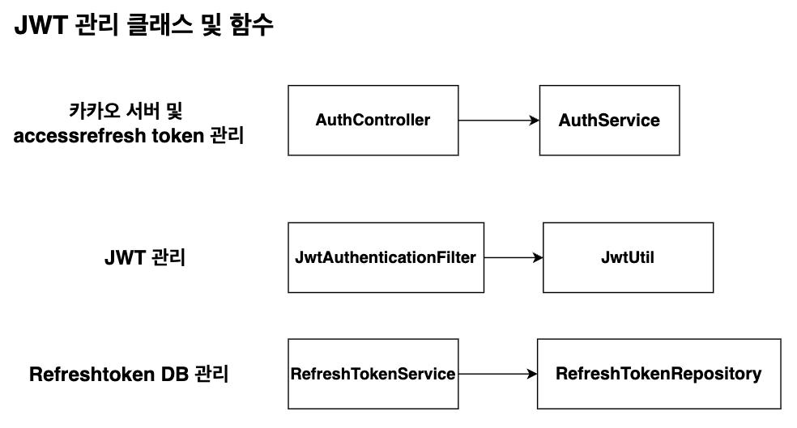
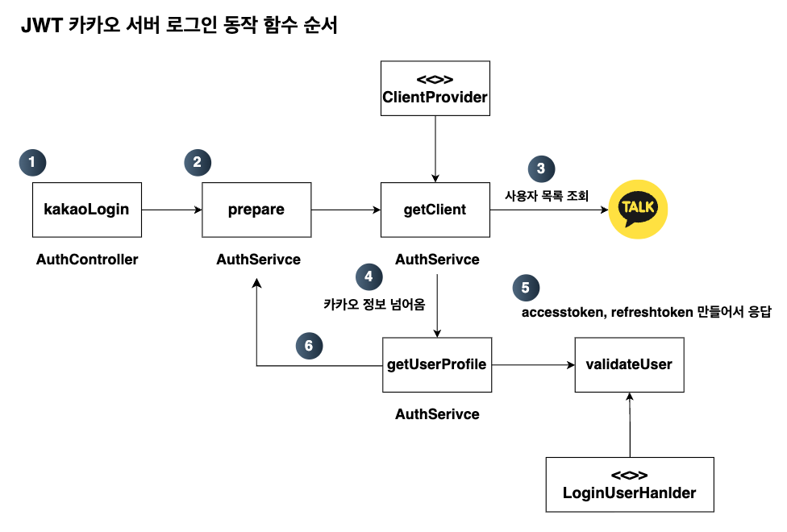
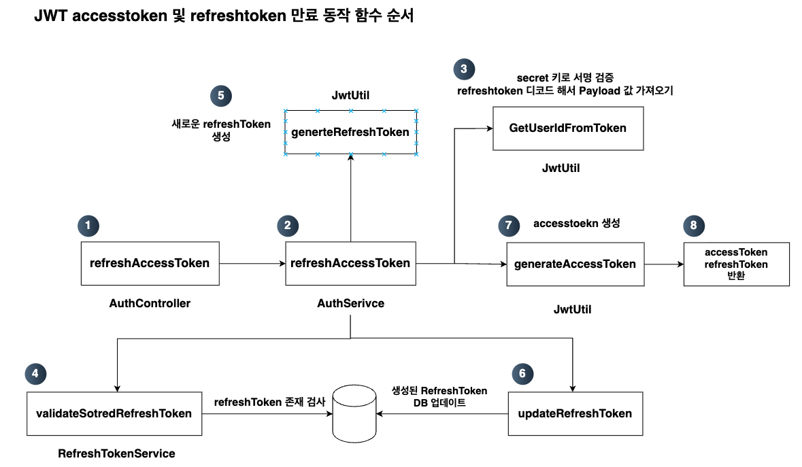

## 🔍 kkrap 로그인 기능
카카오 로그인 Oauth 2.0을 사용해서 서버의 로그인을 구현했습니다. 또한 사용자 인증을 위해 추가한 JWT에 대해 추가한 내용을 작성하였습니다.

### JWT를 개발하기 위한 공부
[블로그 참고: JWT란?](https://wo-dbs.tistory.com/245)

### JWT의 기능 개요 및 목적, 배경
[블로그 참고: JWT 기반 인증 도입 개선 문서](https://wo-dbs.tistory.com/246)

## 로그인 기능 구현
### 1. 카카오 서버 로그인 및 JWT 관리 클래스 모음

  

- 다음은 JwtUtil의 코드를 분석한 블로그이다. Jwt 관리 코드를 보고 싶으면 다음과 같은 블로그를 보고 오면 된다.  
[블로그 참고: [Spring boot] JWT 관리 코드 분석](https://wo-dbs.tistory.com/247)

- 다음은 JWT 로그인 요청 검증 방법에 대해 기술하였다. 여기에 SecurityConfig가 어떻게 동작하는지 설명이 나와있다.  
  [블로그 참고: [Spring boot] JWT 로그인 요청 검증 방법](https://wo-dbs.tistory.com/248)

- 다음은 accesstoken과 refreshtoken의 에러 처리에 대한 문제점이 발생해서 spring boot의 동작 흐름을 보면서 어떻게 JWT의 대한 검증이 되는지 fillter과 servelt까지 포함해서 설명해놓은 글이다.  
  [블로그 참고: [Spring boot] JWT Accesstoken 및 Refresh 검사 흐름?](https://wo-dbs.tistory.com/249)

### 2. JWT를 통한 로그인 구현 시나리오
- JWT 기반 인증 도입 개선 문서에 나온 지금까지 개발된 카카오 로그인 방식에서 JWT를 추가하고 어떻게 처리하는 지에 대한 내용을 밑에서 보여줍니다.

  

- 다음은 서버 내부에서 로그인 동작함수가 어떻게 되는지 보여주는 다이어그램입니다.

  

### 3. Accesstoken 만료 및 refreshtoken 만료 시나리오

  

- 다음은 서버 내부에서 accesstoken 만료 및 refresh 만료에 대한 코드가 어떻게 진행되는지 보여줍니다.

  

