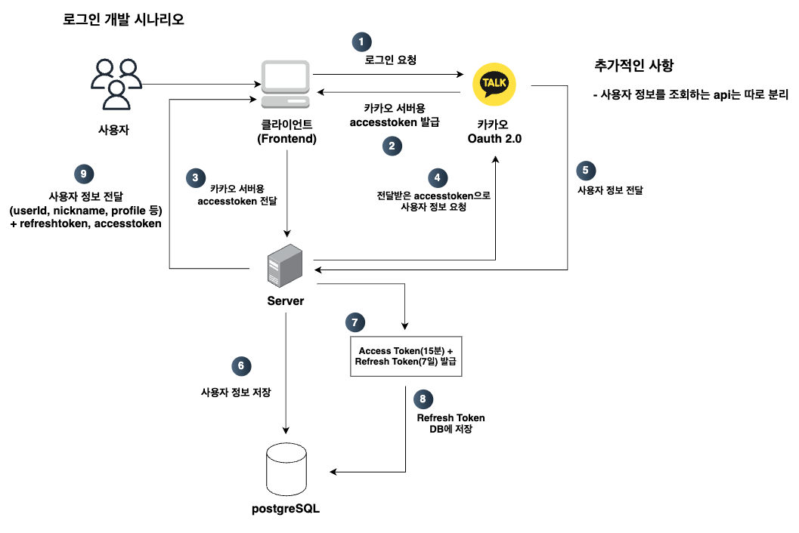
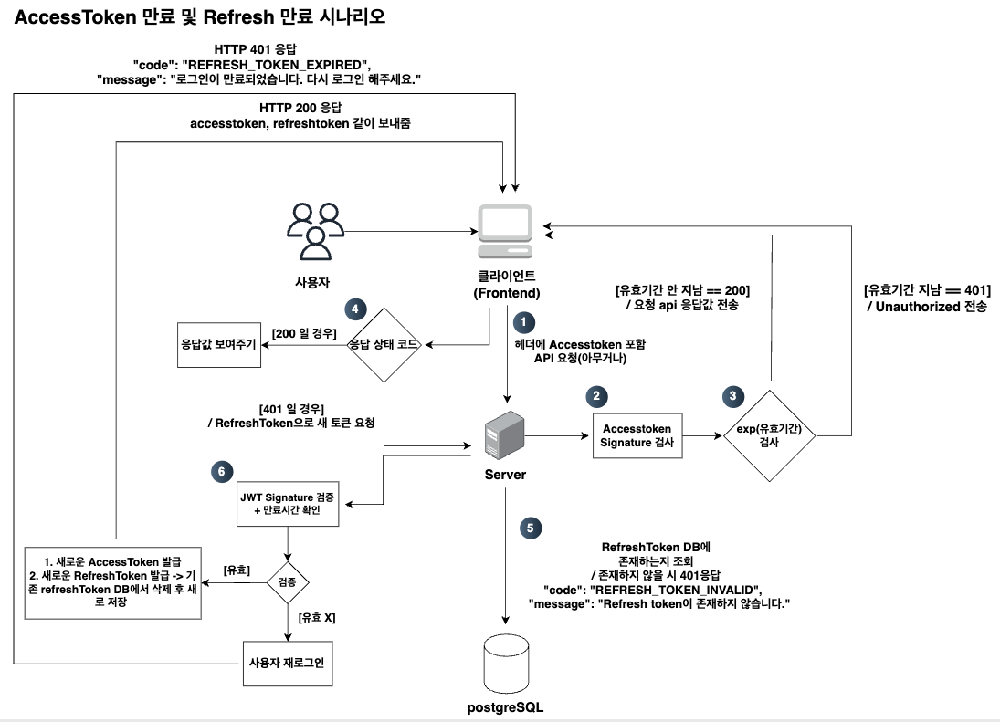

## 🔍 kkrap 로그인 기능
카카오 로그인 Oauth 2.0을 사용해서 서버의 로그인을 구현했습니다. 또한 사용자 인증을 위해 추가한 JWT에 대해 추가한 내용을 작성하였습니다.

### JWT를 개발하기 위한 공부
[블로그 참고: JWT란?](https://wo-dbs.tistory.com/245)

### JWT의 기능 개요 및 목적, 배경
[블로그 참고: JWT 기반 인증 도입 개선 문서](https://wo-dbs.tistory.com/246)

## 로그인 기능 구현
### 1. JWT를 통한 로그인 구현 시나리오
- JWT 기반 인증 도입 개선 문서에 나온 지금까지 개발된 카카오 로그인 방식에서 JWT를 추가하고 어떻게 처리하는 지에 대한 내용을 밑에서 보여줍니다.

  

### 2. Accesstoken 만료 및 refreshtoken 만료 시나리오

  

